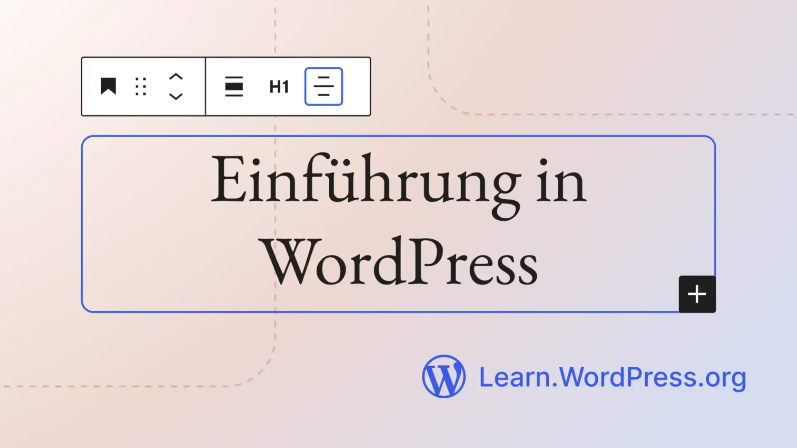
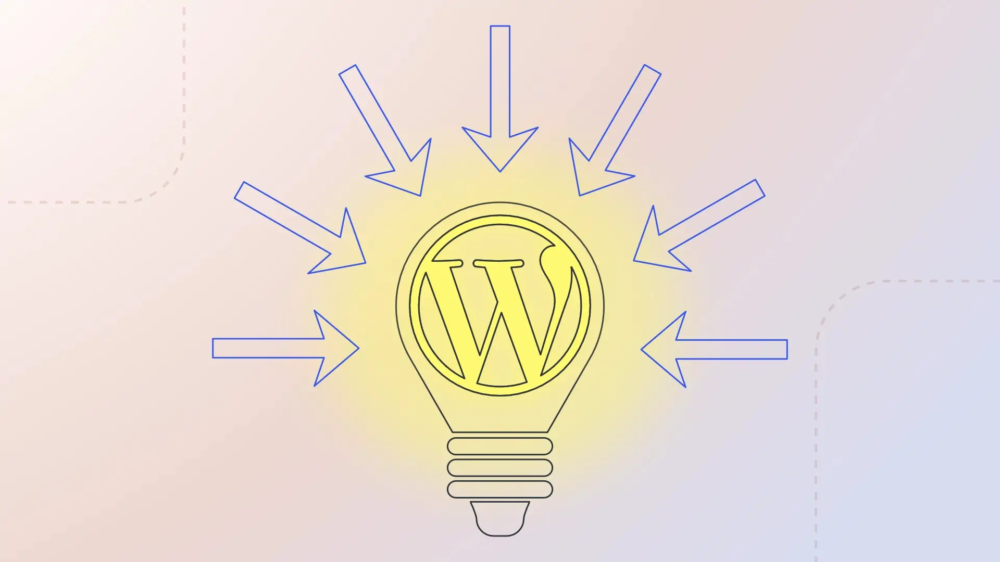
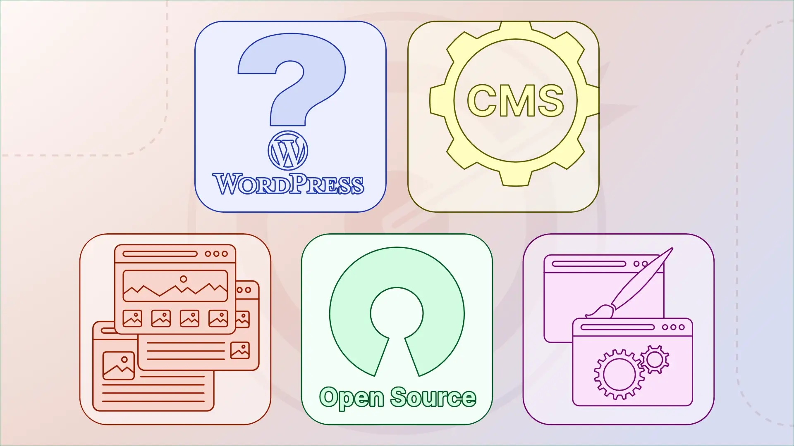
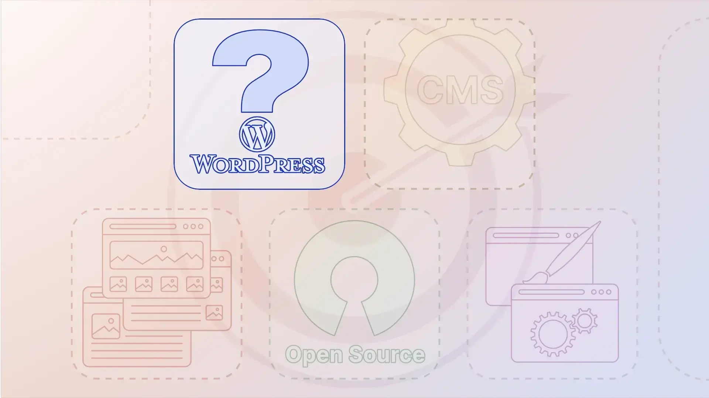
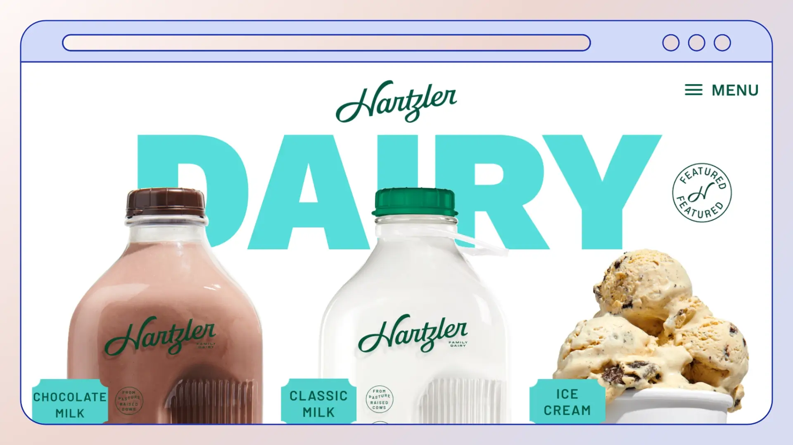
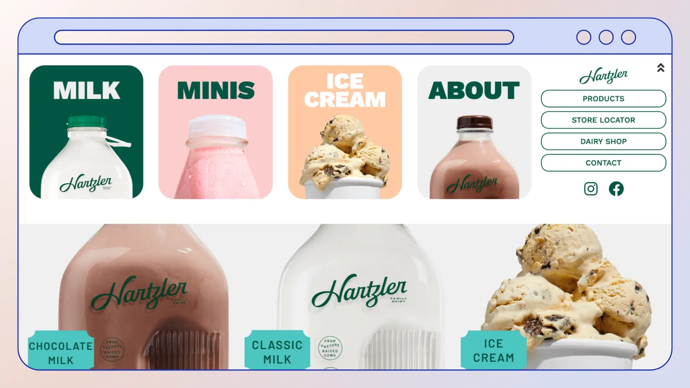

# Storyboard

## Additional material

### 00-01 Thumbnail

Created using the Thumbnail Generator, based on the original English version thumbnail.
Further information about the Thumbnail Generator can be found on the [Video Thumbnail Generator](https://make.wordpress.org/design/handbook/resources/figma-thumbnail-generator/) website.

**Image:**

- [Original image](../src/assets/00-01-Thumbnail.png)
 
## Chapter 01 Intro

> Duration: 0:00:00;00 - 0:00:18;17

### Scene 01-01 Start

> Duration: 0:00:00;00 - 0:00:07;23

An animation of the thumbnail image to indicate the video is starting and to welcome the participants.

**Assets:**

- [Scene-01-01-Start-background.png](../src/assets/Scene-01-01-Start-background.png)
- [Scene-01-01-Start-lines.png](../src/assets/Scene-01-01-Start-lines.png)
- [Scene-01-01-Start-text.png](../src/assets/Scene-01-01-Start-text.png)
- [Scene-01-01-Start-toolbar.png](../src/assets/Scene-01-01-Start-toolbar.png)
- [Scene-01-01-Start-wordpress.png](../src/assets/Scene-01-01-Start-wordpress.png)

### Scene 01-02 Bulb

> Duration: 0:00:07;24 - 0:00:18;17

An animation of a light bulb to illustrate the goal of the lesson.

**Image License:**
- Light Bulb & Arrows [CC0](https://creativecommons.org/publicdomain/zero/1.0/deed.en)
- WordPress Logo see: [Trademark Policy – WordPress Foundation](https://wordpressfoundation.org/trademark-policy/)

**Assets:**

- [Scene-01-02-Bulb.pdf](../src/assets/Scene-01-02-Bulb.pdf)

## Chapter 02 Learning Outcomes

> Duration: 0:00:18;17 - 0:00:42;18

### Scene 02-01 Learning outcomes

> Duration: 0:00:18;17 - 0:00:42;19

An animation to introduce the chapters of the lesson.

**Image License:**

- WordPress Logo see: [Trademark Policy – WordPress Foundation](https://wordpressfoundation.org/trademark-policy/)
- Everything else [CC0](https://creativecommons.org/publicdomain/zero/1.0/deed.en)

**Assets:**

- [Scene-02-01-Learning-outcomes.pdf](../src/assets/Scene-02-01-Learning-outcomes.pdf)

## Chapter 03 What is WordPress

> Duration: 0:00:42;20 - 0:01:58;29

### Scene 03-01 Define WordPress

> Duration: 0:00:42;20 - 0:00:49;07

**Image License:**

- WordPress Logo see: [Trademark Policy – WordPress Foundation](https://wordpressfoundation.org/trademark-policy/)
- Everything else [CC0](https://creativecommons.org/publicdomain/zero/1.0/deed.en)

**Assets:**

- See: [Scene-02-01-Learning-outcomes.pdf](../src/assets/Scene-02-01-Learning-outcomes.pdf)

### Scene 03-02 Hartlerdairy

> Duration: 0:00:49;08 - 0:00:53;08

**Image License:**

- Screenshots [Rachel Hartzler](https://www.hartzlerdairy.com)
- Browser graphic [CC0](https://creativecommons.org/publicdomain/zero/1.0/deed.en)

**Assets:**

- [Scene-03-02-Hartlerdairy.pdf](../src/assets/Scene-03-02-Hartlerdairy.pdf)
- [Scene-03-02-Hartlerdairy-front.webp](../src/assets/Scene-03-02-Hartlerdairy-front.webp)
- [Scene-03-02-Hartlerdairy-menu.webp](../src/assets/Scene-03-02-Hartlerdairy-menu.webp)
- [Scene-03-02-Hartlerdairy-browser.webp](../src/assets/Scene-03-02-Hartlerdairy-browser.webp)

### Scene 03-03 TechCrunch

> Duration: 0:00:53;08 - 0:00:53;08

--- **English** ---
--- **Translation** ---

### Scene - Oh She Glows

--- **English** ---
--- **Translation** ---

### Scene 03-04 Crack Magazine

--- **English** ---
--- **Translation** ---

### Scene 03-05 No Man’s Sky

--- **English** ---
--- **Translation** ---

### Scene 03-06 Rolling Stone

--- **English** ---
--- **Translation** ---

### Scene 03-07 NASA

--- **English** ---
--- **Translation** ---

## Chapter 04 WordPress as a Content Management System (CMS)

### Scene 04-01 CMS

--- **English** ---
--- **Translation** ---

### Scene 04-02 Dashboard

--- **English** ---
--- **Translation** ---

### Scene 04-03 Extreme photography

--- **English** ---
--- **Translation** ---

### Scene 04-04 Business to Entrepreneur

--- **English** ---
--- **Translation** ---

### Scene 04-05 Showcase

--- **English** ---
--- **Translation** ---

## Chapter 05 Examples of WordPress Websites

### Scene 05-01 Our journey

--- **English** ---
--- **Translation** ---

### Scene 05-02 Reliable

--- **English** ---
--- **Translation** ---

### Scene 05-03 WordPress Logo

--- **English** ---
--- **Translation** ---

### Scene 05-04 Ballarat

--- **English** ---
--- **Translation** ---

### Scene 05-05 Absolute Plumbing

--- **English** ---
--- **Translation** ---

### Scene 05-06 Minimalist baker

--- **English** ---
--- **Translation** ---

### Scene 05-07 Mrs. O

## Chapter 06 WordPress as Open Source

### Scene 06-02 Free

--- **English** ---
--- **Translation** ---

### Scene 06-03 Get WordPress

--- **English** ---
--- **Translation** ---

### Scene 06-04 Make WordPress

## Chapter 07 Themes and Plugins

### Scene 07-01 Themes | Plugins

--- **English** ---
--- **Translation** ---

### Scene 07-02 Themes

--- **English** ---
--- **Translation** ---

### Scene 07-03 Plugins

--- **English** ---
--- **Translation** ---

### Scene 07-04 Site Editor

--- **English** ---
--- **Translation** ---

### Scene 07-06 Everyone

--- **English** ---
--- **Translation** ---

## Chapter 08 Next Steps (original)
## Chapter 08 Next Steps (new)

### Scene 08-01 Question

--- **English** ---
--- **Translation** ---

### Scene-08-02-01-N-Learn-WordPress

--- **English** ---
--- **Translation** ---

### Scene-08-02-N-1-Learn-WordPress

--- **English** ---
--- **Translation** ---

## Chapter 09 Outro

### Scene-09-01-Learn-WordPress-org