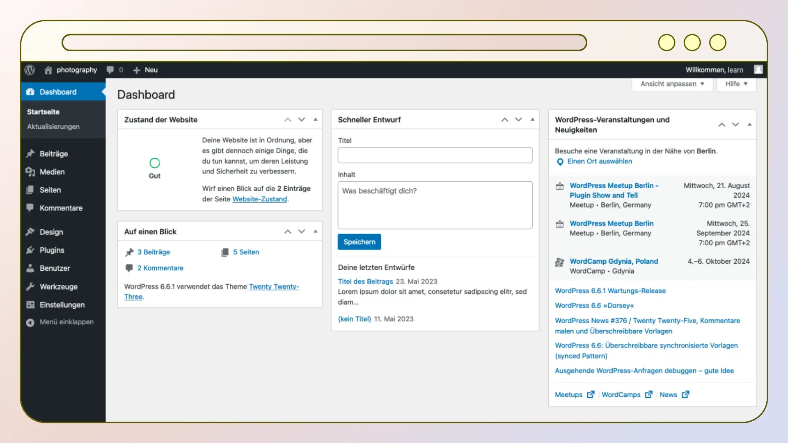

# Storyboard

This visual representation of the instructional video contains a detailed sequence of scenes and outlines the entire course of the video. It serves as a basic guide and starting point for the entire production.

An overview of all documents and files related to this project can be found in the [README](../README.md) file.

## Additional material

### 00-01 Thumbnail

The thumbnail image of the video was translated based on the thumbnail of the English version.

## Chapter 01: Einführung in WordPress / *Introduction to WordPress*

### Scene 01-01 Start

An animation of a light bulb illustrates the lesson's main goal, effectively communicating the overall objective of the learning videos. This visual not only highlights WordPress, placing it in a favorable light, but also ensures that viewers grasp the intended purpose and context right from the beginning.

### Scene 01-02 Bulb

An animation of a light bulb to illustrate the main goal of the lesson.

## Chapter 02: Lernziele / *Learning objectives**

The "Learning Objectives" chapter outlines the specific goals of each section and emphasizes the importance of clear communication. These objectives are conveyed through graphics, supporting individuals with reading difficulties and facilitating easier translation of the video into other languages. This clarity helps learners always know their progress, boosting motivation.

### Scene 02-01 Learning outcomes

Introducing a dynamic animation designed to guide learners through the various chapters of the lesson. This engaging visual tool not only outlines the key segments but also serves to inspire and motivate learners to complete the entire lesson. By highlighting the progression, it enhances understanding and retention.

## Chapter 03: Was ist WordPress? / *What is WordPress?*

WordPress is a versatile platform that enables users to create websites or blogs. It's the backbone for millions of sites, from online shops and small businesses to renowned entities like NASA, the Meta Newsroom, and the Walt Disney Company. The following scenes convey these insights in this chapter.

### Scene 03-01 Define WordPress

An animation introduces the chapter "What is WordPress?" while keeping the graphics of other chapters visible. This design allows learners to easily orient themselves and track their progress throughout the course.

### Scene 03-02 Hartlerdairy

A brief animation showcases the first example of a website, illustrated using the Hartzler Dairy website as an example. It vividly displays the homepage and the website's menu.

### Scene 03-03 TechCrunch

TechCrunch is a premier technology media platform focused on profiling startups, reviewing new internet products, and delivering the latest tech news. Powered by WordPress, the site provides in-depth analysis, interviews, and insights into current technology trends.

### Scene 03-04 Crack Magazine

As the first example, "Crack Magazine" showcases a WordPress site with a cutting-edge design and seamless user experience, highlighting WordPress's flexibility. Focused on contemporary music and culture, it offers in-depth interviews, reviews, and articles. Its sleek design provides an immersive experience for enthusiasts.

### Scene 03-05 No Man’s Sky

As the second example, the "No Man's Sky" website highlights the diverse capabilities of WordPress. The site features fantastic graphics and animations that capture the game's vastness. With intuitive navigation and multimedia content, it impressively showcases the gaming experience and demonstrates WordPress's versatility.

### Scene 03-06 Rolling Stone

As the third example, the "Rolling Stone" website demonstrates WordPress's capabilities with its dynamic design and user-friendly interface. Focused on legendary rock band news and updates, it features rich multimedia content, including videos and photos, offering fans an engaging and comprehensive experience.

### Scene 03-07 NASA

The NASA website exemplifies a standout WordPress site with its sleek design and intuitive navigation. It offers a wealth of information on space exploration, scientific discoveries, and missions. Featuring stunning imagery, videos, and interactive content, it provides an engaging and educational experience for space enthusiasts.

Additionally, the websites for "The Walt Disney Company" and "Meta Newsroom" are highlighted, as mentioned in the spoken text of the English version of the video. The Walt Disney Company site offers insights into its entertainment empire, while the Meta Newsroom provides updates on company developments and innovations.

## Chapter 04: WordPress als Content-Management-System (CMS) / *WordPress as a Content Management System (CMS)*

The "WordPress as a Content Management System (CMS)" chapter presents WordPress as a versatile tool for creating and managing websites or blogs without programming skills. It supports personal sites, blogs, and e-commerce. With over 40% of websites using WordPress, its reliability is clear. The chapter's scenes effectively convey these insights.

### Scene 04-01 CMS

An animation featuring a gear introduces the "Content Management System" chapter, highlighting WordPress's reliability as a CMS. This design keeps the graphics of other chapters visible, allowing learners to easily orient themselves and track their progress throughout the course.

### Scene 04-02 Dashboard

This is the first introduction to the WordPress dashboard, using the "Extreme Photography" website to demonstrate WordPress's extensive capabilities. The dashboard is shown without simplification or data neutralization, anticipating future changes that will require updates. Clear cuts in production ensure this section can be easily replaced when needed.

### Scene 04-03 Extreme photography

Unfortunately, the "Extreme Photography" website from the English-language video couldn't be found. However, the video was included because it showcases a beautifully designed site that demonstrates the extensive capabilities of WordPress.

### Scene 04-04 Business to Entrepreneur

The animation sequence begins with the WordPress logo and showcases three videos, illustrating WordPress's suitability for all types of websites. The highlighted WordPress logo reinforces this versatility. Background sounds emphasize the practical relevance and enhance focus on the central message.

### Scene 04-05 Our journey

A screenshot of the page "WordPress and the Journey to 40% of the Internet" highlights WordPress's widespread popularity. This visual reassurance helps dispel any doubts learners might have about choosing the right platform, emphasizing its extensive adoption and reliability.

### Scene 04-06 Reliable

An animation graphically illustrates that WordPress is reliable, secure, and sustainable. The subsequent checkmark, accompanied by sound effects, powerfully emphasizes this central message, reinforcing the platform's key strengths.

## Chapter 05: Beispiele für WordPress-Websites / *Examples of WordPress Websites*

The "Examples of WordPress Websites" chapter demonstrates the platform's versatility through various site functionalities. It includes examples of e-commerce capabilities, service presentation, content-rich blogging, and interactive travel guides. The chapter's scenes effectively highlight how WordPress supports diverse website needs and industries.

### Scene 05-01 Examples

An animation introduces the "Examples of WordPress Websites" chapter, clearly illustrating the diverse variations of example sites. This design keeps the graphics of other chapters visible, allowing learners to easily orient themselves and track their progress throughout the course.

### Scene 05-02 Ballarat

An animation of the Art Gallery of Ballarat website exemplifies a WordPress site, showcasing Australia's oldest regional gallery. It highlights the gallery's extensive art collection, exhibitions, and educational programs. The site also features an online store for jewelry and gifts, all within a user-friendly design.

### Scene 05-03 Absolute Plumbing

The Absolute Plumbing website exemplifies a WordPress site, showcasing a Cape Town-based plumbing service. It highlights the company's range of services, customer testimonials, and contact information. The site features a user-friendly design, ensuring easy navigation and access to essential service details.

### Scene 05-04 Minimalist baker

The Minimalist Baker website exemplifies a WordPress site, focusing on simple, accessible recipes. It highlights a variety of dishes, cooking tips, and kitchen product recommendations. The site features a clean, user-friendly design, ensuring easy navigation and access to culinary inspiration.

### Scene 05-05 Mrs. O

The Mrs. O Around the World website exemplifies a WordPress site, focusing on luxury travel experiences. It highlights travel tips, destination guides, and personal insights. The site features an elegant, user-friendly design, ensuring easy navigation and access to premium travel content.

## Chapter 06: WordPress ist Open Source / *WordPress is Open Source*

The "WordPress is Open Source" chapter aims to underscore the platform's accessibility and collaborative spirit. It sets the stage for understanding how WordPress's open-source nature invites community participation and enhancement. The following scenes vividly illustrate this goal, highlighting the collective effort that drives WordPress's evolution.

### Scene 06-01 Open Source

An animation introduces the "WordPress is Open Source" chapter, featuring the Open Source logo to symbolize the openness and inclusivity of the open-source philosophy. The green color emphasizes the versatility and vibrancy of this concept. This design keeps the graphics of other chapters visible, allowing learners to easily orient themselves and track their progress throughout the course.

### Scene 06-02 Free

An animation featuring a stamp and accompanying sound effect powerfully illustrates that WordPress is free. This dynamic presentation strongly emphasizes the cost-free nature of the platform.

### Scene 06-03 Get WordPress

An animation based on the WordPress.org download page clearly demonstrates where and how easily WordPress can be downloaded. It guides viewers through the straightforward process, highlighting the prominent download button and emphasizing the simplicity of accessing the platform. This visual walkthrough ensures that users understand the ease of obtaining WordPress for their projects.

### Scene 06-04 Make WordPress Menu

An animation transitions from the "Frontpage of WordPress" to the "Make WordPress" page, effectively guiding users through the navigation process. This seamless movement highlights the pathway to community involvement and contribution opportunities within the WordPress ecosystem.

### Scene 06-05 Make WordPress

An animation presents the "Make WordPress" page, illustrating the diversity of the WordPress community. It highlights the wide range of opportunities for participation in the WordPress project, showcasing how individuals can contribute to various aspects of the platform's development and growth.

## Chapter 07: Themes and Plugins / *Themes and Plugins*

The "Themes and Plugins" chapter emphasizes the importance of these elements in creating a WordPress site. It introduces themes as the key to your site's design, with thousands of options available. Plugins are highlighted for their ability to enhance functionality, from e-commerce to security. The following scenes vividly illustrate these concepts, showcasing the versatility and customization possibilities within WordPress.

### Scene 07-01 Themes | Plugins

An animation introduces the "Themes and Plugins" chapter, featuring graphics that symbolize the visual enhancement provided by themes and the functional expansion offered by plugins. This design keeps the graphics of other chapters visible, allowing learners to easily orient themselves and track their progress throughout the course.

### Scene 07-02 Themes

An animation showcases the "Themes" page of WordPress, highlighting the diverse range of themes available. It carefully presents various categories to demonstrate the vast selection without overwhelming learners, effectively conveying the richness of options while maintaining clarity.

### Scene 07-03 Plugins

An animation showcases the "Plugins" page of WordPress, highlighting the extensive selection of plugins. It emphasizes the most important categories, providing a glimpse into the vast array of options without overwhelming learners, ensuring clarity and focus on key functionalities.

## Chapter 08: Zusammenfassung und Ausblick / *Summary and Outro*

The "Summary and Outro" chapter highlights WordPress's ability to create websites without technical skills, emphasizing its features, customization, and free access. Graphics from previous chapters are revisited, providing a concise recap. The following scenes further illustrate these concepts, guiding you to become a WordPress pro with resources from learn.wordpress.org.

### Scene 08-01 Summary

This page summarizes the learning module, reinforcing the learning objectives and deepening understanding through a comprehensive recap of the material.

### Scene 08-02 Question

A simple animation featuring a question mark captures the viewer's attention, posing the question: "You might be wondering how to create your website easily with WordPress and get it online for everyone to see." This clear and engaging presentation prompts an internal response of "Yes, exactly!"

### Scene 08-03 Learn.WordPress.org Click

An animation prominently displays the URL of Learn.WordPress.org, creating anticipation. The oversized mouse pointer emphasizes the URL, reinforcing the site's name. By answering the previously posed question with "We have a solution for that too," the animation effectively guides the viewer's attention to the URL, completing the narrative arc.

### Scene 08-03 Learn.WordPress.org Website

A page presents a preview version of the Learn.WordPress.org website, designed for longevity and reducing the need for frequent updates. This strategy emphasizes the site's new learning paths, drawing attention to its evolving educational offerings.

### Scene 08-04 Outro

An animation begins with puzzle pieces, symbolizing the diverse offerings of the training team. It transitions to a message wishing learners success and expressing delight in accompanying them on their educational journey. The underlining animation reinforces the clarity and importance of this supportive message.