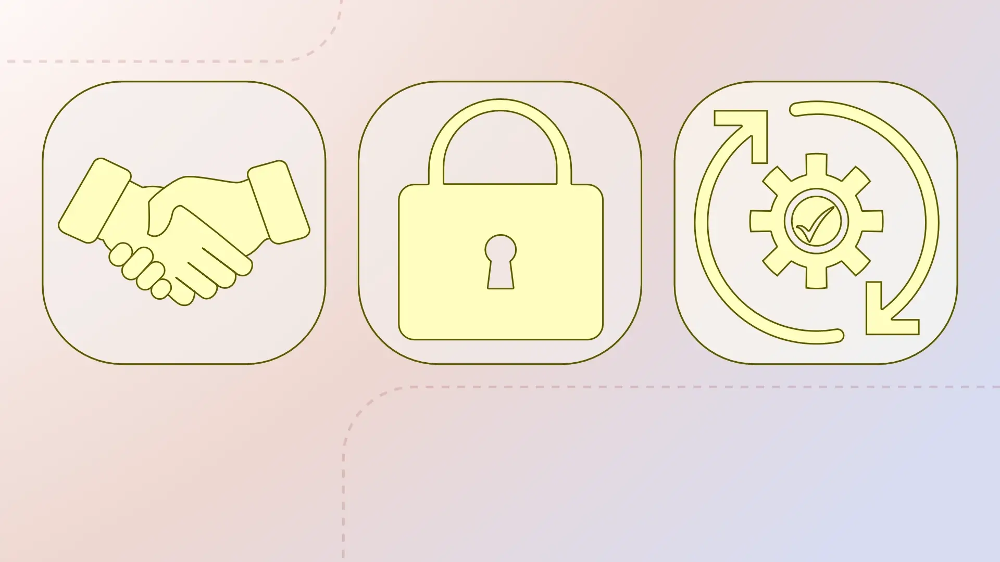
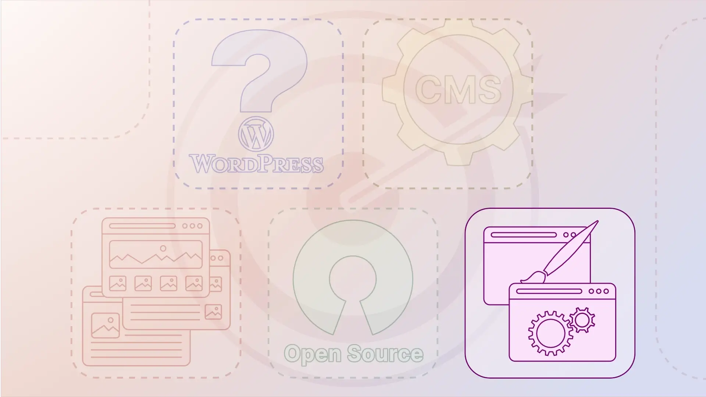
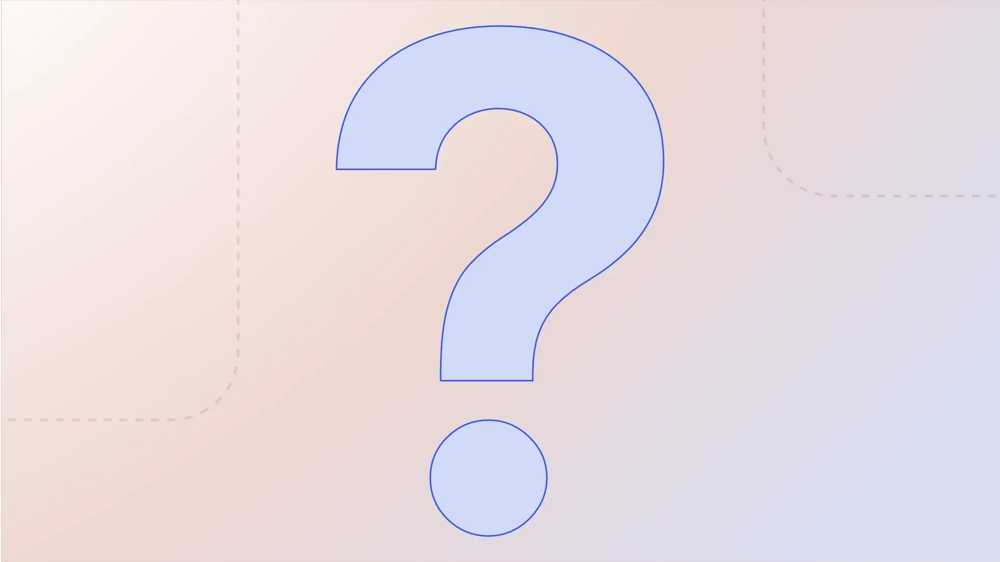

# Storyboard

## Additional material

### 00-01 Thumbnail

## Chapter 01: Einführung in WordPress / *Introduction to WordPress*

### Scene 01-01 Start

An animation of the thumbnail image to indicate the video is starting and to welcome the participants.

### Scene 01-02 Bulb

An animation of a light bulb to illustrate the goal of the lesson.

## Chapter 02: Lernziele / *Learning objectives**

### Scene 02-01 Learning outcomes

An animation to introduce the chapters of the lesson.

## Chapter 03: Was ist WordPress? / *What is WordPress?*

### Scene 03-01 Define WordPress

Animation for the 'Define WordPress' Chapter.

### Scene 03-02 Hartlerdairy

A brief animation showcases the first example of a website, illustrated using the Hartzler Dairy website as an example. It vividly displays the homepage and the website's menu.

### Scene 03-03 TechCrunch

An animation demonstrating scrolling through the TechCrunch website serves as an example of a blog site.

### Scene 03-04 Crack Magazine

"Crack Magazine" as the first static example of a website, demonstrating the diverse capabilities of WordPress.

### Scene 03-05 No Man’s Sky

"No Man's Sky" as the second static example of a website, demonstrating the diverse capabilities of WordPress.

### Scene 03-06 Rolling Stone

"Rolling Stone" as the third static example of a website, demonstrating the diverse capabilities of WordPress.

### Scene 03-07 NASA

“NASA” is an animation of static websites as the fourth example of a website that demonstrates the diverse possibilities of WordPress. In addition, the pages “The Walt Disney Company” and “Meta Newsroom” are shown, which are mentioned as examples in the spoken text.

## Chapter 04: WordPress als Content-Management-System (CMS) / *WordPress as a Content Management System (CMS)*

### Scene 04-01 CMS

Animation for the 'Content Management System' Chapter.

### Scene 04-02 Dashboard

Introduction to the demonstration of the 'Extreme Photography' website through the WordPress dashboard, to showcase the extensive capabilities of WordPress.

### Scene 04-03 Extreme photography

Video of the 'Extreme Photography' website, demonstrating the extensive capabilities of WordPress.

### Scene 04-04 Business to Entrepreneur

An animation sequence that displays three videos to demonstrate the diversity of WordPress websites.

### Scene 04-05 Our journey

A screenshot of the page "WordPress and the Journey to 40% of the Internet" to illustrate the popularity of WordPress.

### Scene 04-06 Reliable

Animation to illustrate that WordPress is reliable, secure, and sustainable.

## Chapter 05: Beispiele für WordPress-Websites / *Examples of WordPress Websites*

### Scene 05-01 Examples

Animation for the 'Examples of WordPress Websites' Chapter.

### Scene 05-02 Ballarat

Anmation of the Ballarat website as an example of a WordPress website.

### Scene 05-03 Absolute Plumbing

An animation of the Absolute Plumbing website as an example of a WordPress website.

### Scene 05-04 Minimalist baker

An animation of the Minimalist Baker website as an example of a WordPress website.

The page was adapted from the original English learning module.

### Scene 05-05 Mrs. O

An animation of the Mrs. O website as an example of a WordPress website.

## Chapter 06: WordPress ist Open Source / *WordPress is Open Source*

### Scene 06-01 Open Source

Animation for the 'WordPress is Open Source' Chapter.

### Scene 06-02 Free

An animation to illustrate that WordPress is free.

### Scene 06-03 Get WordPress

A static page demonstrating how to download WordPress.

### Scene 06-04 Make WordPress Menu

An animation that leads from the “Frontpage of WordPress” page to the “Make WordPress” page.

### Scene 06-05 Make WordPress

An animation that presents the "Make WordPress" page and illustrates the diversity of the WordPress community.

## Chapter 07: Themes and Plugins / *Themes and Plugins*

### Scene 07-01 Themes | Plugins

Animation for the 'Themes and Plugins' Chapter.

### Scene 07-02 Themes

An animation showcasing the "Themes" page of WordPress, presenting the wide variety of themes available for selection.

### Scene 07-03 Plugins

An animation showcasing the "Plugins" page of WordPress, presenting the wide variety of plugins available for selection.

## Chapter 08: Zusammenfassung und Ausblick / *Summary and Outro*

### Scene 08-01 Summary

Static page summarizing the content of the learning module.

### Scene 08-02 Question

An animation that poses a question to the viewer.

### Scene 08-03 Learn.WordPress.org Click

An animation that prominently displays the URL of Learn.WordPress.org.

### Scene 08-03 Learn.WordPress.org Website

A static page that displays the Learn.WordPress.org website.

### Scene 08-04 Outro

An animation in which the training team wishes learners much success and emphasizes how pleased they are to accompany learners on their educational journey.